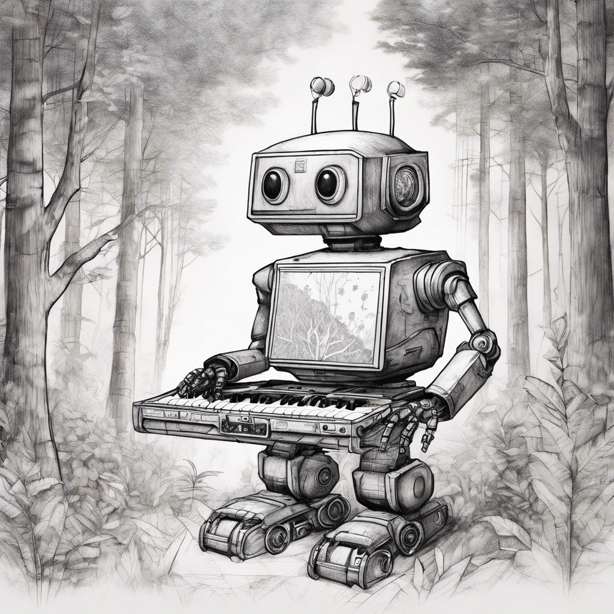

## Background

 Author: spipm
 Category: Crypto / Hackcracking
 Difficulty: Medium to Hard

## Technical

Four words are hashed using MD5 and then they are hashed using Argon2. The MD5 hashes are pixelized using Gimp.

## Story

Through the trees you see a singing robot, rocking it on its keyboard. "Some day!" it sings, "Soome day, we'll expand all our keys, no one needs to see, except you and me. Can this pixel be us? Can it be cracked? Well if we hack it, we'll hack it togetheeer". The robot suddenly stops singing, making a sound that can only be described a robot sighing. "What's wrong?" you ask. "I hashed the last four words of my lyrics to keep them safe, " the robot explains. "But the image fell into a pool of pixels and now I can't read it!"

Can you help the robot recover its lyrics?

## Exploit

Cracking a 4-word hash should take too long. Recover parts of hashes with Depix or [Unredacter](https://github.com/BishopFox/unredacter), then run solve.py. The solve script takes the partially recovered hashes and cracks them with the rockyou wordlist.

## Flag

brck{ENHANCE_Sharp1_hollyw00d_h4ck1ng}