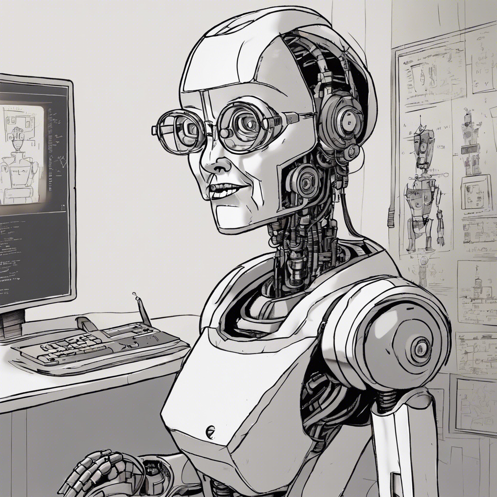

## Background

    Author: spipm
    Category: Programming / Misc
    Difficulty: Easy

## Technical

The flag is blurred using a linear motion blur.

## Story

A creaky old bot is zooming in and out of an eye chart. "Can you read the bottom line?" the doctor asks. "No way, " the bot replies. "At a certain distance my view becomes convoluted. Here, I'll make a screenshot."

You and the doctor look at the screenshot. Can you tell what's wrong with the bot's visual processor?

## Exploit

Simple use [this](https://github.com/opencv/opencv/blob/3.2.0/samples/python/deconvolution.py) script from OpenCV to reverse the blurring operation.

## Flag

brck{4ppr04ch1tfr0M4D1ff3r3ntAngl3}